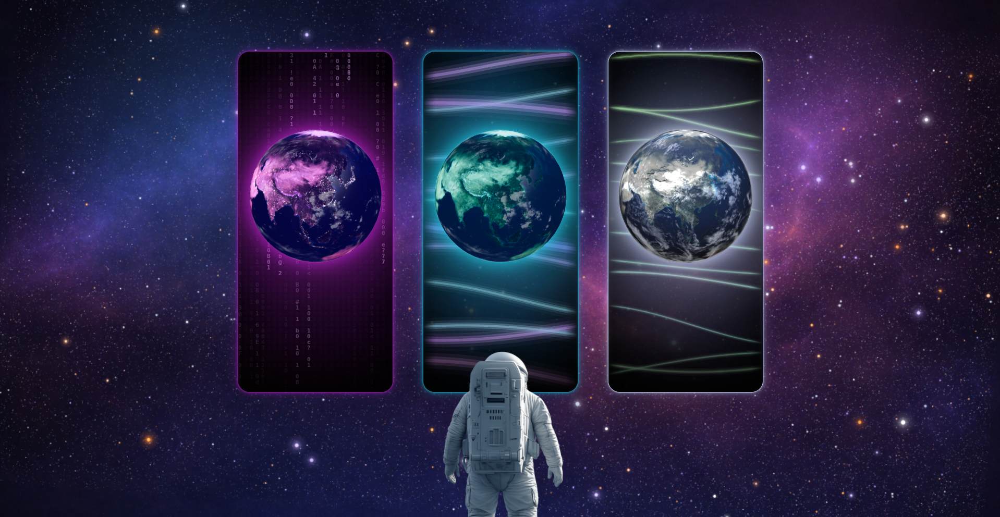

# tommitoan.com

Personal website for Toan Ngo, built as a static Next.js space gateway with three routes: `Tech`, `Discover`, and `Feng Shui`.

<div align="center">
  
</div>

<h3 align="center">
  <a href="https://tommitoan.com/" target="_blank">Live Demo</a>
</h3>

## Routes

- `/` — gateway homepage with 3 interactive 3D portals
- `/tech` — engineering profile and CV route (7 sections: Hero, About, Skills, Experience, Education, Projects, Contact)
- `/discover` — homelab, experiments, and public channels (coming soon)
- `/fengshui` — Bazica and symbolic-product route (coming soon)

## Tech Stack

- **Framework**: Next.js (App Router, static export)
- **Styling**: Tailwind CSS v4 via `@tailwindcss/postcss`
- **3D**: React Three Fiber + Three.js (planet rendering)
- **Animation**: Framer Motion
- **Fonts**: Space Grotesk (display), Instrument Sans (body)

## Repo Structure

```
src/
  app/              route entry points, layouts, metadata, sitemap, robots, manifest
  components/
    canvas/         WebGL astronaut scene
    gateway/        homepage scene, planet renderer, loading screen, gateway config
    layout/         shared header, footer, page shell
    tech/           tech route sections and shared motion helpers
  content/          route copy and structured content (portfolio.ts, site-content.ts, etc.)
  lib/              metadata helper and utilities
public/
  gateway/          homepage backgrounds, astronaut, planet textures
  profile/          profile imagery
  projects/         project previews
  skills/           skill icon images
  announcement/     coming-soon imagery
```

## Commands

```bash
pnpm install
pnpm dev        # dev server at http://localhost:3000
pnpm lint       # ESLint
pnpm typecheck  # TypeScript strict check
pnpm build      # static export to out/
pnpm start      # serve the out/ directory
```

## Architecture Notes

### z-index scale

All gateway z-index values are defined as CSS custom properties in `src/app/globals.css`:

| Token | Value | Layer |
|-------|-------|-------|
| `--z-background` | 0 | space background image |
| `--z-overlay` | 1 | color/vignette overlay |
| `--z-stars` | 2 | star canvas |
| `--z-content` | 3 | main content wrapper |
| `--z-portal` | 50 | portal frame cards |
| `--z-astronaut` | 60 | astronaut WebGL canvas |
| `--z-flash` | 100 | route transition flash |
| `--z-loading` | 140 | loading screen |

### Gateway source of truth

Homepage scene configuration lives in `src/components/gateway/gatewayHomeConfig.ts`. That file controls:
- shared background and starfield settings
- portal labels, routes, themes, and effects
- frame size and row spacing
- planet textures, size, hover motion, and alignment
- astronaut asset, placement, idle motion, and warp motion
- selection timing, zoom, and flash behavior

### Content source of truth

| File | Controls |
|------|---------|
| `src/content/portfolio.ts` | All tech page copy (hero, skills, experience, education, projects) |
| `src/content/site-content.ts` | Navigation, site meta, footer, discover copy |
| `src/content/fengshui-content.ts` | Feng Shui content (prepared for future use) |

### Page backgrounds

- The `(content)` layout provides a shared space background + overlay for `/tech`, `/discover`, `/fengshui`.
- The `/tech` page adds its own `tech-bg.png` fixed background and a custom star canvas config — these override the layout background intentionally.
- The gateway (`/`) manages its own full-screen background independently.

## Docs

- `docs/features.md`
- `docs/implementation.md`
- `docs/configuration.md`
- `docs/gateway-config.md`
- `docs/run-guide.md`
- `docs/notes.md`

## Notes

- The app uses static export via `next.config.ts` (`output: "export"`).
- No environment variables are required for local development.
- Canonical contact email: `tommitoan1995@gmail.com`.
